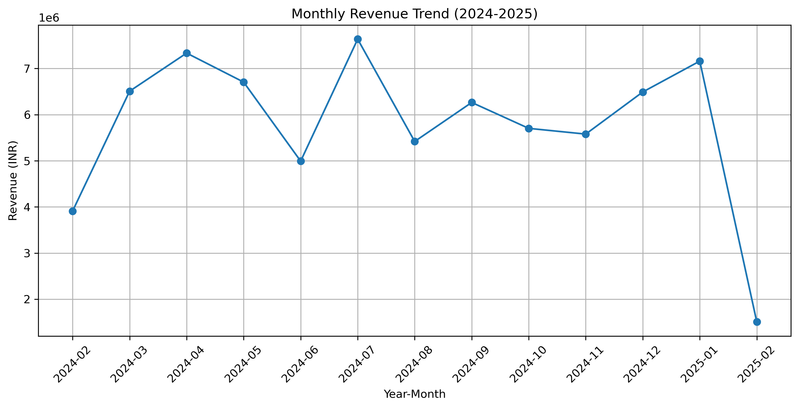
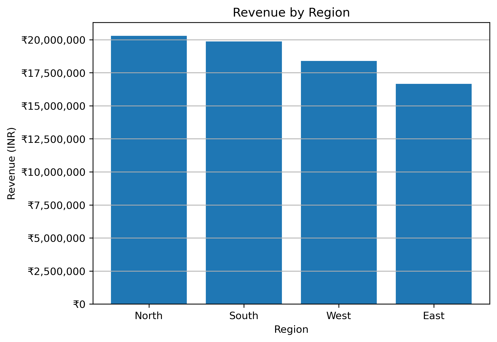
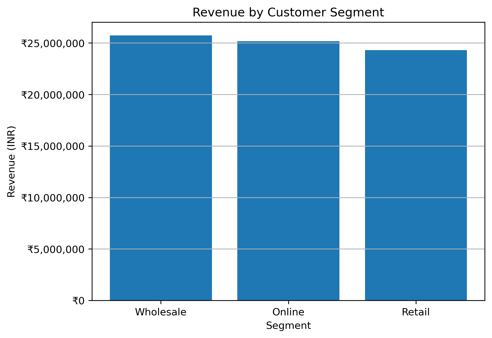
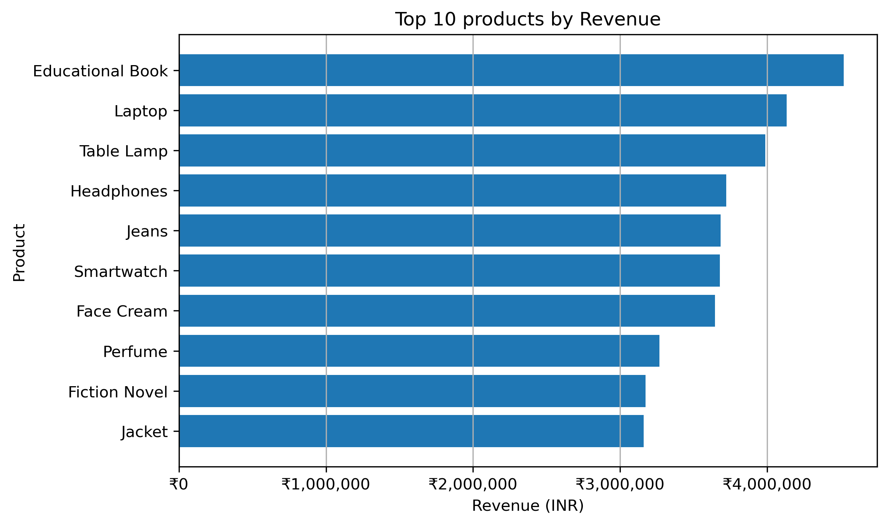
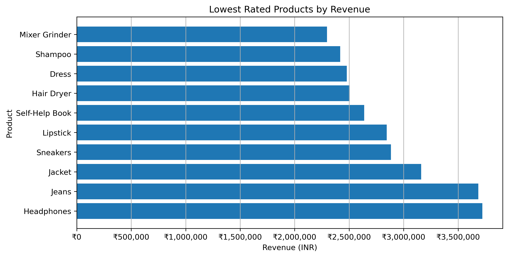
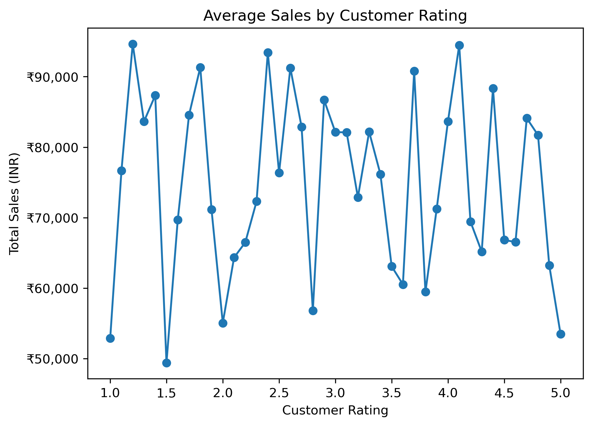

# sales-analytics-flipkart-case-study
Sales Analytics | Python | Pandas | Revenue Analysis | Pricing Strategy | Product Risk Evaluation

## 🚀 Project Summary

This project analyzes Flipkart transactional sales data (2024–2025) to uncover revenue drivers, evaluate discount effectiveness, identify underperforming products, and provide data-driven business recommendations.

All analysis was conducted using Python (Pandas, Matplotlib) in Jupyter Notebook.

## 📁 Dataset

Source: Kaggle

Dataset Link: https://www.kaggle.com/datasets/hamzanathwala/flipkart-sales-dataset

Size: 1,000 transaction-level records

Time Period: 2024–2025

Type: Simulated e-commerce retail dataset
The dataset includes:

- Product & category information

- Customer segments

- Regional sales

- Discount %

- Customer ratings

- Profit & revenue metrics

The dataset represents multi-category retail sales across regions, customer segments, and payment channels, allowing end-to-end sales performance analysis.

## 🎯 Business Questions Addressed

1. How is overall revenue trending over time?

2. Which categories and regions drive the highest sales?

3. Do discounts meaningfully increase revenue?

4. Which products generate the most revenue?

5. Which products are underperforming and risky?

6. How does customer rating relate to revenue?

📈 Key Findings

# 🔹 Revenue Performance

Revenue remains relatively stable with seasonal peaks.

July 2024 and January 2025 show strong performance.

February 2025 shows lower revenue (likely partial-month data).

📊 Monthly Revenue Trend

# 🔹 Category & Regional Performance
Top Revenue Categories:

Electronics

Clothing

Books

Regional Insight:

North and South outperform other regions.

East region shows comparatively lower revenue contribution.

📊 Revenue by Category

📊 Revenue by Region

# 🔹 Customer Segment Analysis

Revenue contribution is well-balanced across:

Wholesale

Online

Retail

Indicates diversified revenue streams with low concentration risk.

📊 Revenue by Customer Segment

# 🔹 Discount Effectiveness Analysis

Correlation between Discount % and Total Sales:

−0.016

This indicates:

No meaningful relationship between higher discounts and increased sales.

Aggressive discounting does not significantly drive revenue.

Product demand likely plays a stronger role than pricing strategy.

📊 Discount vs Sales

📊 Average Sales by Discount Level

# 🔹 Product-Level Revenue Drivers
Top Revenue Products:

Educational Book

Laptop

Table Lamp

Headphones

Revenue is diversified across multiple products, reducing dependency risk.

📊 Top 10 Products by Revenue

# 🔹 Underperforming Products (Risk Analysis)

Products filtered based on:

Average Rating ≤ 3

Lower Revenue Contribution

Examples:

Mixer Grinder

Shampoo

Dress

Hair Dryer

These represent potential:

Product improvement opportunities

Pricing repositioning candidates

Discontinuation evaluation candidates

📊 Underperforming Products

# 🔹 Customer Rating vs Revenue

No clear linear relationship between rating and sales.

Some mid-rated products generate strong revenue.

Suggests brand strength and category demand influence sales beyond rating alone.

📊 Average Sales by Customer Rating  

# 📌 Business Implications

Discount-heavy strategies may not increase revenue significantly.

East region presents growth opportunity.

Focus should shift from price competition to demand optimization.

Underperforming low-rated products require strategic review.

Revenue is diversified across segments and categories — strong portfolio stability.

# 🛠 Tools Used

Python

Pandas

NumPy

Matplotlib

Jupyter Notebook

# 💼 Skills Demonstrated

- Sales Data Analysis

- Business Insight Generation

- Correlation Analysis

- Risk Identification

- KPI Evaluation

- Data Visualization

- E-commerce Revenue Strategy
