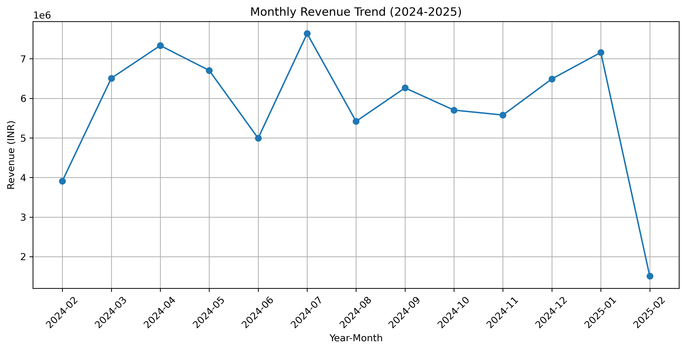
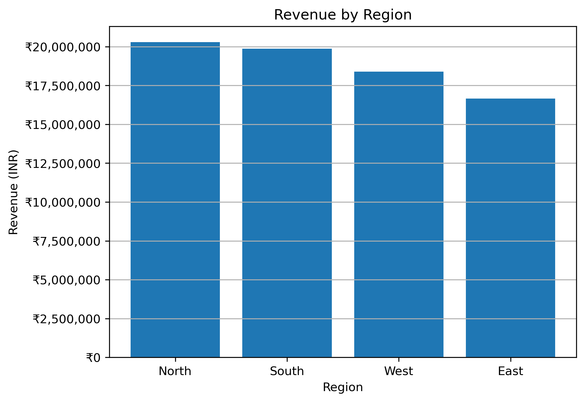
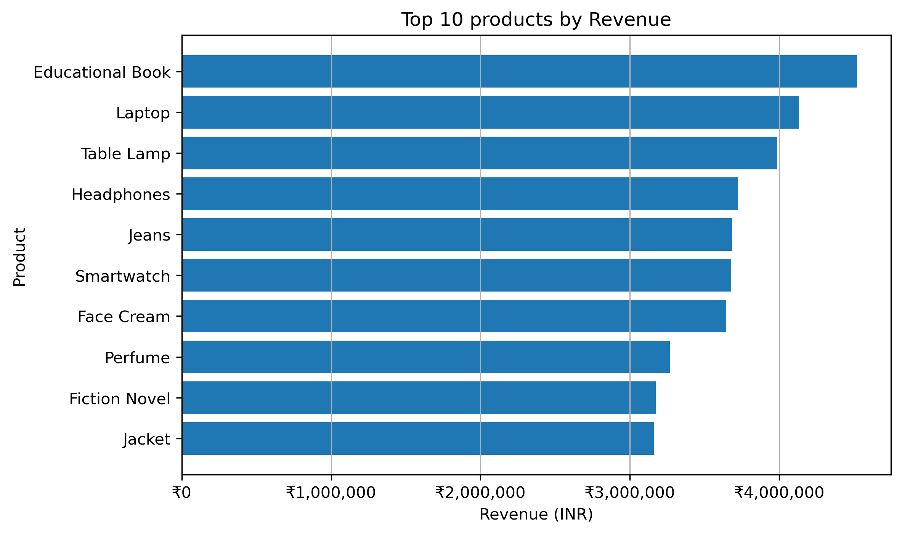
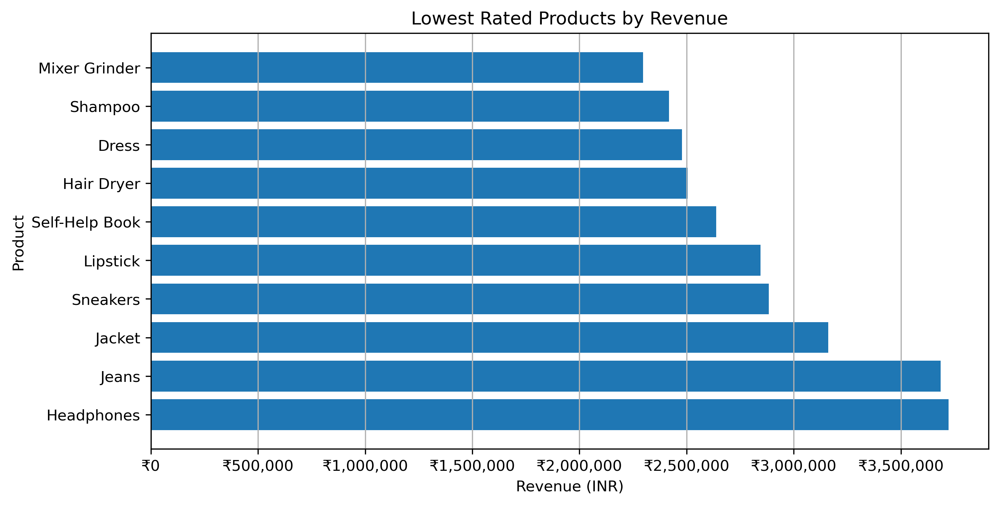
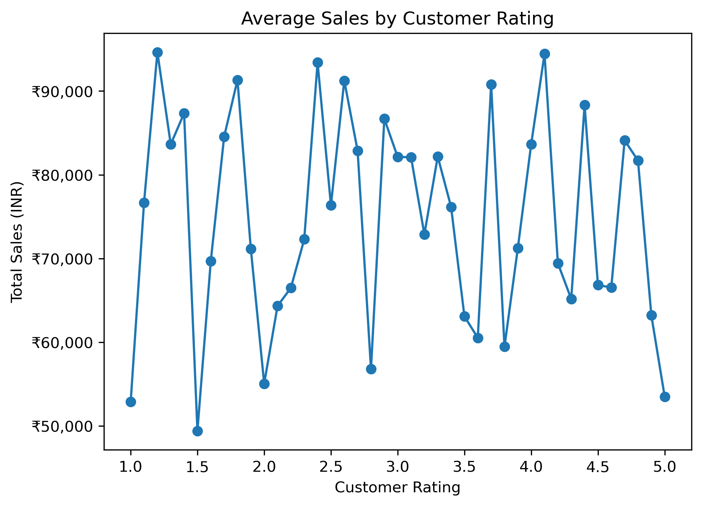

# Flipkart Sales Analytics — Revenue, Discounts & Product Risk


---

## ● The Business Context

Flipkart processes millions of transactions across categories, regions, customer segments, and payment channels. For a business analyst, the challenge is not collecting that data — it is knowing **which questions to ask** and **what the answers actually mean** for strategy.

This project simulates the work of a sales analyst assigned to a Flipkart-style e-commerce portfolio. Using 1,000 transaction records from 2024–2025, it investigates six core business questions and delivers findings the way an analyst would present them in a real business review — with numbers, charts, and actionable recommendations.

---

## ● Dataset

**Source:** Kaggle — [Flipkart Sales Dataset](https://www.kaggle.com/datasets/hamzanathwala/flipkart-sales-dataset)

| Property | Detail |
|---|---|
| Records | 1,000 transactions |
| Period | 2024 – 2025 |
| Type | Simulated e-commerce retail |
| Scope | Multi-category, multi-region, multi-segment |

**Fields available for analysis:**

```
Product & category information     →  what was sold
Customer segment                   →  who bought it (Wholesale / Online / Retail)
Regional breakdown                 →  where it was sold
Discount %                         →  how much was discounted
Customer rating                    →  how satisfied was the buyer
Profit & revenue metrics           →  how much money was made
```

---

## ● Six Business Questions This Project Answers

```
Q1.  Is revenue trending up, down, or flat — and when are the peaks?
Q2.  Which categories and regions are our biggest revenue contributors?
Q3.  Does giving bigger discounts actually increase sales?
Q4.  Which individual products are driving the most revenue?
Q5.  Which products are underperforming and carry the most risk?
Q6.  Does a higher customer rating lead to higher sales?
```

> These are not academic questions. Every one of these is asked in real
> business reviews by product managers, sales leads, and finance teams.

---

## ● Analysis & Findings

---

### Q1 — Revenue Trends Over Time

**Method:** Grouped transactions by month using `resample()` and plotted a line chart.

**Finding:**
- Revenue is relatively stable across the period with identifiable seasonal peaks
- **July 2024** and **January 2025** show the strongest monthly performance
- **February 2025** shows lower revenue — likely a partial-month data artifact, not a real decline

**Business Implication:**
> July and January are peak periods. Inventory planning, marketing spend, and
> staffing decisions should anticipate these surges — not react to them.



---

### Q2 — Category & Regional Performance

**Method:** `groupby('category')['revenue'].sum()` and `groupby('region')['revenue'].sum()`, sorted descending.

**Category findings:**

| Rank | Category | Performance |
|---|---|---|
| 1 | Electronics | Highest revenue contributor |
| 2 | Clothing | Strong second |
| 3 | Books | Solid mid-tier |

**Regional findings:**

| Region | Status | Insight |
|---|---|---|
| North | Strong | Top revenue region |
| South | Strong | Close second |
| East | Weak | Underperforming — growth opportunity |
| West | Mid | Stable but not leading |

**Business Implication:**
> Electronics and Clothing are the revenue backbone. East region is underperforming —
> this is not necessarily bad news. It signals untapped potential worth investigating:
> is it a distribution gap, pricing issue, or demand problem?




---

### Q3 — Discount Effectiveness Analysis

**Method:** Calculated Pearson correlation between `Discount %` and `Total Sales`. Plotted scatter and bar chart of average sales by discount bracket.

**Finding:**

```
Correlation between Discount % and Total Sales:  −0.016
```

A correlation of **-0.016** is effectively **zero** — there is no meaningful
relationship between how much a product is discounted and how much revenue it generates.

**What this means in plain language:**
- Offering a 30% discount does not drive significantly more sales than offering 10%
- Customers are not primarily motivated by discount size
- Product demand, brand strength, and category relevance matter more than price cuts

**Business Implication:**
> This is one of the most strategically important findings in this project.
> If discounts are not driving revenue, then aggressive discounting is simply
> **margin destruction** — the business is giving away profit for no measurable gain.
> Recommendation: shift budget from blanket discounting to demand-side marketing.


---

### Q4 — Top Revenue-Generating Products

**Method:** `groupby('product')['revenue'].sum().sort_values(ascending=False).head(10)`

**Top performers:**

| Rank | Product | Why It Matters |
|---|---|---|
| 1 | Educational Book | Consistent demand across segments |
| 2 | Laptop | High unit value drives revenue |
| 3 | Table Lamp | Surprising mid-tier performer |
| 4 | Headphones | Strong Electronics sub-category |

**Business Implication:**
> Revenue is spread across multiple products — this is a sign of **portfolio stability**.
> No single product is responsible for a disproportionate share of revenue, which
> reduces concentration risk. However, the top 4 products should be protected
> from stockouts and pricing errors above all others.



---

### Q5 — Underperforming Products (Risk Analysis)

**Method:** Filtered products where `Average Rating ≤ 3` AND revenue contribution was below the median. Cross-referenced both signals to flag genuine risk.

**Products flagged:**

| Product | Risk Signal | Recommended Action |
|---|---|---|
| Mixer Grinder | Low rating + low revenue | Pricing review or discontinue |
| Shampoo | Low rating + low revenue | Product quality investigation |
| Dress | Low rating + low revenue | Category repositioning |
| Hair Dryer | Low rating + low revenue | Supplier / quality audit |

**Why using BOTH signals matters:**
> A low-rated product with high revenue still has loyal customers — fix quality
> but do not discontinue. A low-rated product with low revenue has neither
> satisfaction nor sales — this is the true risk zone and needs immediate action.



---

### Q6 — Customer Rating vs Revenue

**Method:** `groupby('rating')['revenue'].mean()` — plotted average revenue per rating bucket.

**Finding:**
- No clear linear relationship between rating and revenue
- Some **mid-rated (3–3.5 star)** products generate strong revenue
- High-rated products do not automatically generate the highest sales

**What this means:**
> Brand recognition and category demand override satisfaction scores in driving
> purchases. This suggests customers are buying based on need and awareness —
> not just reviews. Implication: fixing underperforming products may not
> immediately recover revenue unless visibility and demand also improve.



---

## ● Summary of Key Findings

| Finding | Insight | Priority |
|---|---|---|
| Discounts have near-zero correlation with sales | Stop margin-destroying discount strategies | 🔴 High |
| East region underperforms | Investigate root cause — distribution or demand gap | 🟡 Medium |
| Electronics + Clothing drive revenue | Protect inventory and pricing for these categories | 🔴 High |
| 4 products flagged as high-risk | Review, reposition, or discontinue | 🟡 Medium |
| Revenue diversified across segments | Portfolio is stable — no over-reliance on one channel | 🟢 Positive |
| Rating ≠ Revenue | Marketing and visibility strategy matters beyond quality scores | 🟡 Medium |

---

## ● What This Project Demonstrates for Interviews

```
TECHNICAL SKILLS
  ✅  Python EDA workflow — load, clean, group, aggregate, visualise
  ✅  Correlation analysis — calculated and correctly interpreted near-zero result
  ✅  Multi-dimensional segmentation — category, region, segment, product, rating
  ✅  Risk identification — dual-signal filtering (rating + revenue)
  ✅  Time-series aggregation — monthly revenue with resample()

ANALYTICAL THINKING
  ✅  Framed analysis around business questions, not just charts
  ✅  Interpreted a near-zero correlation correctly (not as "slightly negative")
  ✅  Distinguished between low-rated/high-revenue vs low-rated/low-revenue risk
  ✅  Connected findings to strategic recommendations a manager would act on

COMMUNICATION
  ✅  Results written for a non-technical business audience
  ✅  Every chart has a "Business Implication" — not just a description
  ✅  Prioritised findings by business urgency (High / Medium / Positive)
```

---

## ● Tools & Libraries

| Tool | Purpose |
|---|---|
| Python | Analysis scripting |
| Pandas | Data loading, cleaning, groupby, aggregation |
| NumPy | Correlation calculation and numerical operations |
| Matplotlib | All charts and visualisations |
| Jupyter Notebook | Interactive analysis with narrative documentation |

---

## ● Project Structure

```
sales-analytics-flipkart-case-study/
│
├── flipkart_sales_analysis.ipynb    ← Full analysis notebook
│
├── data/
│   └── flipkart_sales.csv           ← Raw dataset (download from Kaggle)
│
├── outputs/
│   └── plots/
│       ├── monthly_revenue_trend.png
│       ├── top_categories_revenue.png
│       ├── region_revenue.png
│       ├── segment_revenue.png
│       ├── discount_vs_sales.png
│       ├── avg_sales_by_discount.png
│       ├── top_products.png
│       ├── lowest_rated_products_by_revenue.png
│       └── rating_vs_sales.png
│
└── README.md
```

---

## ● How to Run

```bash
# Clone the repository
git clone https://github.com/pournima2413/sales-analytics-flipkart-case-study
cd sales-analytics-flipkart-case-study

# Install dependencies
pip install pandas numpy matplotlib jupyter

# Download dataset from Kaggle and place in /data folder
# https://www.kaggle.com/datasets/hamzanathwala/flipkart-sales-dataset

# Launch notebook
jupyter notebook flipkart_sales_analysis.ipynb
```

---

**Pournima Kamble** — MS Computer Science @ Cleveland State University (2026)
Seeking Data Analyst & Data Engineer roles · Available June 2026

[](https://linkedin.com/in/pournimakamble)
[](https://github.com/pournima2413)
[](mailto:pournima2413@gmail.com)
